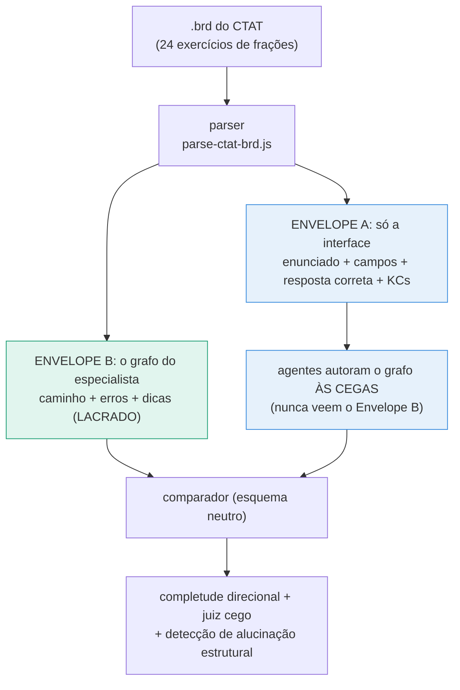
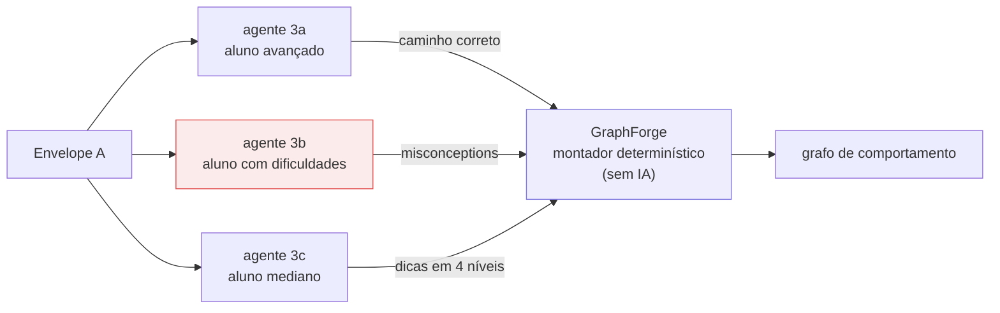

# Validação de grafos de comportamento: agentes de IA × especialista humano (CTAT)

Repositório oficial do experimento de validação dos grafos de comportamento gerados pelos agentes da plataforma **EducaOFF / STI Unplugged**. Ele contém tudo o que é necessário para **reproduzir fielmente** a avaliação: o código completo, o corpus, a base de dados com os dois envelopes, a metodologia, o pré-registro com emenda, os resultados brutos da primeira campanha e o relatório final.

> **Contexto.** A plataforma EducaOFF gera Sistemas Tutores Inteligentes por um pipeline de agentes de IA. O coração de cada tutor é o *grafo de comportamento* (paradigma example-tracing, Aleven et al. 2009/2016): o mapa com o caminho de resolução correto, os erros típicos de aluno (misconceptions) e as remediações. Este experimento responde: **os grafos gerados automaticamente estão corretos?** A comparação é feita contra grafos autorados por um especialista humano na ferramenta CTAT (Carnegie Mellon), sobre os mesmos 24 exercícios de frações na reta numérica.

## A ideia do experimento em um diagrama

Cada arquivo `.brd` exportado do CTAT contém a interface do exercício **e** o grafo do especialista. O parser separa esses dois conteúdos em envelopes disjuntos, e o sistema autora **às cegas**:



A anti-contaminação é garantida por código: existe uma lista de campos proibidos no Envelope A, a função `findLeaksInRobotInput` varre o envelope procurando qualquer um deles, e um teste automatizado quebra a build se encontrar (incluindo um controle negativo com envelope contaminado de propósito, que o teste precisa acusar).

## Como o sistema autora o grafo



A parte criativa (que erros um aluno cometeria, que dica ajudaria) fica com os agentes de IA, os mesmos que rodam em produção na plataforma, sem modificação. A montagem da estrutura é um algoritmo determinístico, e por isso a estrutura é válida por construção (propriedade verificada com 10.000 grafos aleatórios nos testes).

## O que se mede

| Camada | Pergunta | Instrumento |
| --- | --- | --- |
| Nível 1, estrutural | O grafo é bem-formado? | `graph-hallucination.js`: sinais DUROS barram (ciclo patológico, nó órfão, beco sem saída, scaffold órfão); MOLES somam um score com limiar µ+λσ |
| Nível 2, comparativo | Bate com o especialista? | **Veredito 2D**: eixo X = completude conceitual (recall direcional, Tversky 1977); eixo Y = validade dos extras segundo **juiz cego** de família de IA diferente, com calibração e distratores |
| Complementares | | recall de passos separado, equivalência funcional (κ de Cohen), inclusão de traços, F1 auditável, distâncias de edição |

O julgamento do que o sistema **perde** também é medido: um segundo juiz classifica cada erro do especialista não coberto como central, periférico ou mecânico. É isso que separa "a diferença é complementar" de "a lacuna importa".

## Resultados da primeira campanha (2026-07-02)

24 exercícios, 3 réplicas de cada medição, intervalos de confiança de 95%:

| Resultado | Valor |
| --- | --- |
| Grafos com defeito estrutural | **0 de 72** (e 0 em 10.000 grafos de teste) |
| Validade dos extras (juiz cego) | **87%** [79, 92], contra 99% do especialista e 0% dos distratores |
| Completude conceitual | **0,376** [0,310, 0,440] |
| Erros perdidos que são centrais | **56%** [48, 64] |

Leitura honesta: o sistema constrói grafos estruturalmente impecáveis e o que ele adiciona é válido, mas cobre cerca de um terço do catálogo do especialista, e mais da metade do que perde é importante. O veredito formal de não-inferioridade permanece em aberto até existir a banda humano-humano (2 a 3 especialistas por exercício), conforme o pré-registro. O relatório completo, com 10 diagramas e a comparação exercício por exercício, está em [`docs/RELATORIO-CAMPANHA-1.html`](docs/RELATORIO-CAMPANHA-1.html).

## Como reproduzir

Requisitos: Node.js 18+ e uma chave da OpenRouter (https://openrouter.ai/keys). Um único provedor cobre o gerador e o juiz, que são de famílias diferentes de modelo.

```bash
npm install
cp .env.example .env        # cole sua OPENROUTER_API_KEY

npm test                    # 108 testes determinísticos, sem custo de API
npm run materialize         # regenera o dataset a partir dos .brd
npm run eval:real           # avaliação completa: agentes reais × especialista (24 exercícios)
npm run judge:real          # juiz cego: validade dos extras + importância dos perdidos
npm run aggregate           # agrega réplicas em média com IC95%
```

Para replicar a campanha inteira (3 réplicas de cada), rode os comandos de avaliação e juiz três vezes com `--out report-eval-real-N.json` / `--out report-judge-real-N.json` e agregue. O script usado na campanha original está em [`resultados/campanha-2026-07-02/run.sh`](resultados/campanha-2026-07-02/run.sh). A aleatoriedade da parte estatística usa semente fixa: os mesmos dados produzem os mesmos números em qualquer máquina.

## Estrutura do repositório

```
├── docs/
│   ├── RELATORIO-CAMPANHA-1.html      relatório completo da 1ª avaliação (didático, 10 diagramas)
│   ├── METODOLOGIA.md                 desenho metodológico completo (3 níveis, fundamentação, limiares)
│   ├── METODOLOGIA-DETALHADA.md       algoritmos passo a passo, prontos para o artigo
│   ├── PRE-REGISTRO.md                métricas e análises fixadas ANTES dos resultados + EMENDA 1 datada
│   ├── GRAFO-CONHECIMENTO-VS-COMPORTAMENTO.md   a distinção entre os dois grafos
│   └── diagramas/                     8 diagramas SVG da metodologia
├── cases/ctat-6.17/                   CORPUS: 24 exercícios, cada um com expert.brd + interface
├── datasets/frac-numberline-6.17/     BASE DE DADOS: por exercício, envelope-a.json (interface,
│                                      entrada cega dos agentes), envelope-b.json (grafo do
│                                      especialista) e meta.json; manifest com verificação de leaks
├── resultados/campanha-2026-07-02/    dados brutos da campanha: 9 relatórios + agregado + banda
├── parse-ctat-brd.js                  o parser que separa o .brd nos DOIS ENVELOPES
├── simulate-students-real.js          os 3 agentes de produção autorando sobre a interface fixa
├── graphforge.js                      o montador determinístico (idêntico ao de produção)
├── author-from-ctat.js                a autoria cega de ponta a ponta
├── schema.js                          esquema neutro + âncora semântica (canonAnswer, miscKey)
├── metrics.js                         completude direcional (primária) + F1 auditável
├── functional-equivalence.js          equivalência funcional + inclusão de traços
├── graph-hallucination.js             detector de alucinação estrutural (DUROS/MOLES)
├── judge-misconceptions.js            juiz cego (validade) + juiz de importância dos perdidos
├── stats.js                           não-inferioridade, bootstrap de cluster, IC de Wilson
├── run-ctat-eval.mjs / run-judge.mjs  os runners do experimento
├── aggregate-campaign.mjs             agregação de réplicas com IC95%
└── __tests__/                         108 testes, incluindo property tests com 10.000 grafos
```

## A base de dados e os dois envelopes

Cada exercício em `datasets/frac-numberline-6.17/problems/<id>/` tem três arquivos:

- **`envelope-a.json`**: a interface pura (enunciado, componentes de resposta, resposta correta, habilidades). É a única entrada que os agentes recebem.
- **`envelope-b.json`**: o grafo do especialista no esquema neutro (passos, misconceptions com a marcação de mecânicas de interface, transições). Entra apenas no comparador.
- **`meta.json`**: contagens e metadados do exercício.

O `manifest.json` do dataset registra a verificação de vazamento (`leaks: []` para todos). Para gerar a base a partir dos `.brd` originais: `npm run materialize`.

## Fundamentação e fontes

O desenho metodológico combina: example-tracing e CTAT (Aleven et al. 2009/2016), erros sistemáticos de alunos (Brown e Burton 1978; VanLehn 1990), similaridade assimétrica (Tversky 1977), inclusão de traços (van Glabbeek), não-inferioridade (Lakens 2017/2018), Teoria da Generalizabilidade para a banda de especialistas (Shavelson e Webb 1991), viés de autopreferência em juízes de IA (Panickssery et al. 2024), julgamento item a item (GraphEval), e detecção de alucinação estrutural com limiar dinâmico (arXiv 2601.17717, 2509.03857, 2505.24201, 2512.22396). A seção 12 do relatório explica como cada fonte foi usada, técnica por técnica.

## Citação

Se você usar este experimento, o dataset ou o código, cite o repositório (ver `CITATION.cff`) e o artigo correspondente (referência a ser adicionada após a publicação).

## Licença

MIT para o código (ver `LICENSE`). Os arquivos `expert.brd` são exports da ferramenta CTAT (Carnegie Learning / Carnegie Mellon University) autorados para esta pesquisa.
